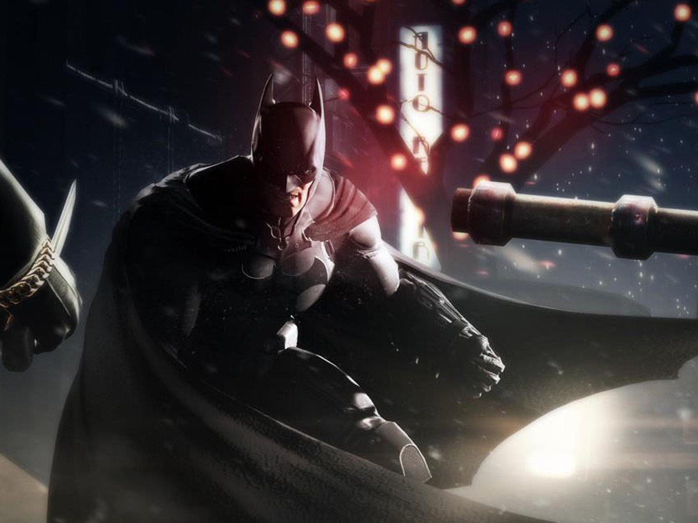
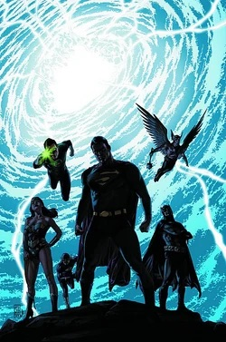
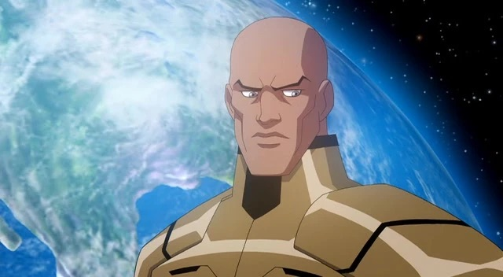

# Quantum Themes in Batman Stories

## Project Idea
Review mentions of quantum in DC comics and analyze the real quantum physics concepts tied to the references being made in the media. 

## Project Motivations
I was inspired to make this because I've liked DC comics for years and it was one of my inspirations to getting into learning quantum because I kept seeing it referrenced so often. 

## Goals
I really liked the talk with Dr. Spiros Michalakis and I want to pursue a similar field to his as it combines two of my hobbies together. The project I made serves as a representation of that overlap between fiction and science that I want to build as a career in the future. 

## Quantum Topics(Tools/Techniques)
**Entanglement**

Math: 
Quantum entanglement is when two particles become linked so that their states are connected, no matter how far apart they are. Mathematically, it means you can’t describe the state of one particle without referring to the other.

Instead of writing the state of a system as a simple product of two separate parts (like |A⟩ ⊗ |B⟩), an entangled state looks more like |Ψ⟩ = (|00⟩ + |11⟩)/√2. This says that if one particle is found in state 0, the other must be too — and same for 1.

[Watch the video](https://www.youtube.com/watch?v=unb_yoj1Usk)

**Many Worlds Interpretation**

Math: In the Many Worlds Interpretation of quantum mechanics, the math follows the Schrödinger equation, which basically tells you how a quantum system changes over time. But instead of saying a particle “chooses” one outcome when you measure it, this interpretation says every possible outcome actually happens, just in different versions of the universe.

So if a particle is in a mix of two states, like |0⟩ and |1⟩, and you measure it, the universe splits: in one version, you see 0, and in another, you see 1. Both outcomes are real, just in separate “worlds.” The math (those numbers like |a|² and |b|²) tells you how likely each world feels to you, but nothing ever collapses or disappears. It’s like a cosmic "choose your own adventure" where every path gets taken.

**Ethics**
There isn't much mathematics involved in the ethics aspect inherently however, as we expand quantum research the mathematics operations that get demanded of quantum computers slowly increases, increasing the energy usage quantum technology would take, possibly presenting greater harm to our planet. 

## Batman: Arkham City – End Game
**Subject: Quantum Entanglement as a Metaphor for Identity**

*Batman: Arkham City – End Game* explores the aftermath of the Joker's final actions. In this storyline, Joker and Batman's psychological connection is described in quasi-quantum terms, such as being "entangled." The idea suggests their fates are bound in a way that defies normal logic, like particles linked across space.

The term quantum is used metaphorically to describe psychological shifts and Joker’s chaotic nature. While not deeply scientific, it hints at quantum unpredictability as a metaphor for Joker's behavior.

In physics, **quantum entanglement** is a phenomenon where two or more particles become linked so that the state of one directly influences the state of the other, no matter the distance between them. While the comic uses this metaphorically, it emphasizes the inseparability of hero and villain in Batman's world.

[Read more](https://batman.fandom.com/wiki/Arkham_City#:~:text=presumably%20Arkham%20Asylum.-,Evacuation%20and%20Shut%20Down,down%20as%20soon%20as%20possible.)

---

## Final Crisis
**Subject: Quantum Multiverse and Observation**

In *Final Crisis*, Batman battles forces that exist beyond space and time, including beings who are "Monitor" entities. These characters view the universe across dimensions, invoking ideas from quantum mechanics and multiverse theory. Batman's apparent death and journey through space-time tie into the collapse of multiple realities.

The **multiverse** is a theoretical structure in quantum physics where every decision or quantum event spawns a new universe. The **observer effect**—a principle where measurement collapses possible states into one outcome—is mirrored in how Batman’s choices shape fate across these multiverses.

[Read more](https://warnerbros.fandom.com/wiki/Quantum_Eigenstate_Device#:~:text=an%20Alternate%20Earth.-,History,and%20Destroyed%20the%20Alternate%20Earth.)

---

## Lex Luthor: Man of Steel
**Subject: Quantum Computing and AI Ethics**

In this limited series, Bruce Wayne appears in Lex Luthor's tech-dominated world. Luthor invests in cutting-edge systems, including quantum computers and AI that challenge ethical boundaries. Batman investigates the possible consequences of such unregulated power, including surveillance and control.

Though not a Batman title directly, Bruce Wayne appears in Luthor’s storyline where quantum computing is mentioned as part of LexCorp’s tech race. Batman investigates potential ethical abuse of quantum AI.

**Quantum computing** utilizes quantum bits (qubits) that can exist in superpositions, enabling powerful computations far beyond classical systems. The story reflects public fears of quantum AI systems making decisions beyond human oversight, something Batman stands firmly against.

[Read more](https://animated-characterdatabase.fandom.com/wiki/Lex_Luthor_(Crisis_on_Two_Earths)#:~:text=However%2C%20the%20decimation%20of%20his,that%20Earth%20without%20harming%20anyone.)
